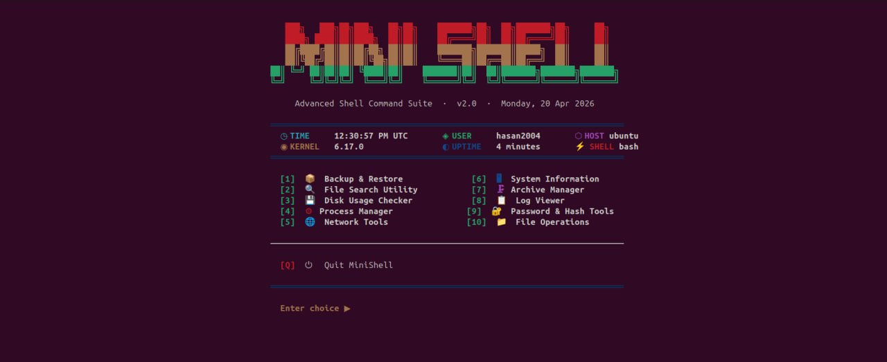
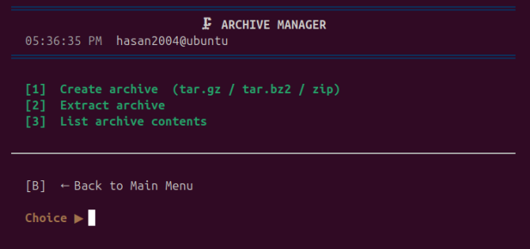
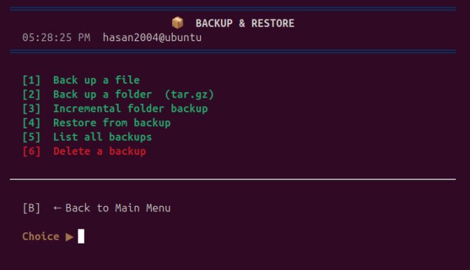
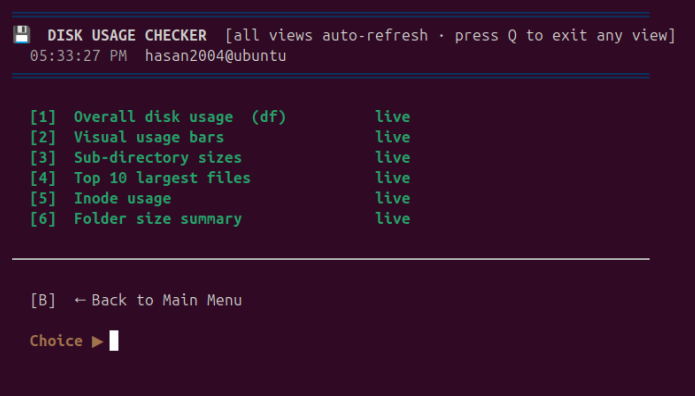
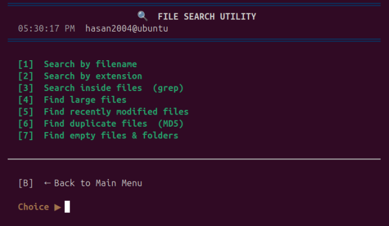
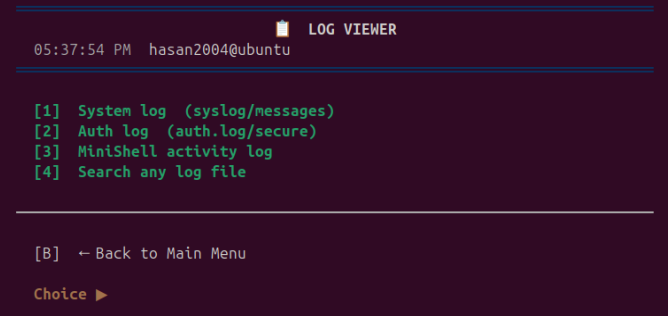
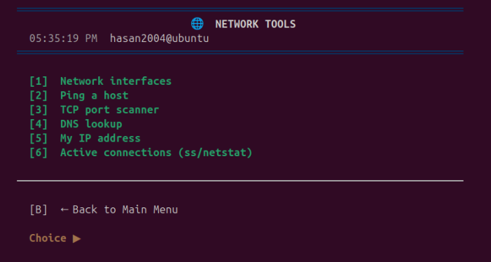
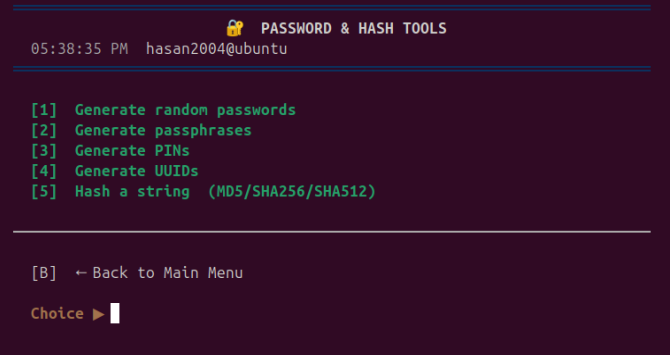
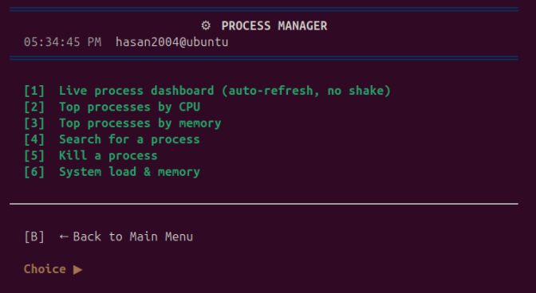
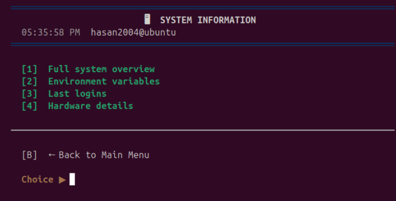

# Mini Shell OS

**Mini Shell OS** is a lightweight Unix-like command-line shell developed for educational purposes. It demonstrates core operating system concepts such as command parsing, process creation, execution, and inter-process communication.

---

## ✨ Features
- Execute both **built-in** and **external commands**
- Support for **input/output redirection**
- **Command pipelining** (`|`)
- Basic **job control**
- **Customizable command prompt**

---

## 🖼️ System Overview


---

## 🧩 Modules & Interfaces

### 📦 Archive Manager


### 💾 Backup and Restore


### 💽 Disk Usage Checker


### 🔍 File Search Utility


### 📜 Log Viewer


### 🌐 Network Tools


### 🔐 Password and Hash Tools


### ⚙️ Process Management


### ℹ️ System Info


---

## 📂 Project Architecture

```bash
mini-shell-os/
│── minishell.c          
│── minishell           
│── README.md           
│── docs/               
│── Images/              
│   ├── SystemDashboard.jpg
│   ├── Archive_Manager.png
│   ├── Backup_and_Restore.png
│   ├── Disk_Usage_Checker.png
│   ├── File_Search_Utility.png
│   ├── Log_Viewer.png
│   ├── Network_Tools.png
│   ├── Password_and_Hash_Tools.png
│   ├── Process_Management.png
│   └── SystemInfo.png
```

---

## ⚙️ How It Works
The shell continuously reads user input, parses it into commands and arguments, and executes them accordingly.

- **Built-in commands** are handled internally within the shell  
- **External commands** are executed using system calls like `fork()` and `exec()`  
- **Pipelines** are implemented using `pipe()`  
- **Redirection** is managed using file descriptors (`dup2()`)  

---


---

## 🚀 Getting Started

### 🔧 Prerequisites
- GCC or compatible C compiler  
- Unix-like environment (Linux, macOS, or WSL)  

---

### 🛠️ Build
```bash
gcc -o minishell minishell.c
```

---

### ▶️ Run
```chmod +x ~/minishel
bash ~/minishell
```

> ⚠️ Do NOT use `bash minishell` — this is a compiled C program, not a script.

---

## ⚠️ Limitations
- Limited job control functionality  
- No advanced scripting support  
- Basic error handling  

---

## 🚀 Future Improvements
- Add command history support  
- Implement auto-completion  
- Improve error handling  
- Extend job control features  

---

## 📚 Documentation
Detailed explanations are available in the `docs/` directory.

---

## 📄 License
This project is licensed under the MIT License.  
See the [LICENSE](LICENSE) file for details.
